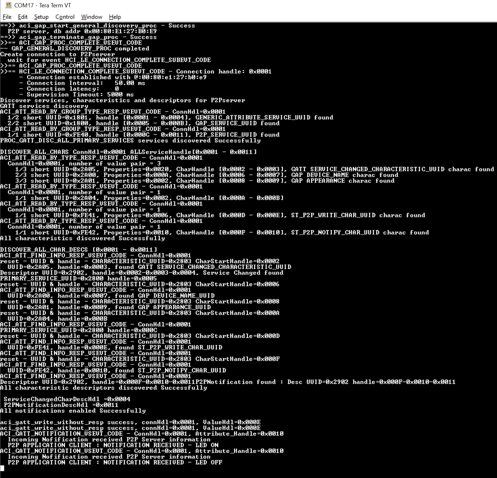

# STM32WBA52-p2p-Client-FreeRTOS

* The STM32WBA52-p2p-Client-FreeRTOS uses FreeRTOS v10.3.1 demonstrating BLE P2P Client example, based on STM32CubeWBA v1.0.0

## Hardware Needed

  * At least [NUCLEO-WBA52CG](https://www.st.com/en/evaluation-tools/p-nucleo-wb55.html) board for running this BLE Client example
  * One BLE_p2pClient using a NUCLEO-WBA52CG or P-NUCLEO-WB55 board.

## Software Needed

  * Build this project using IAR EWARM v9+

## User's Guide

1) Flash each P2P Client and Server examples

2) Use terminal programs like Tera Term to see the logs of each boards via the onboard ST-Link. (115200/8/1/n)

    

3) Press B1 from the NUCLEO-WBA52CG to start scanning nearby P2P Server devices

4) If there's a P2P Server device advertising nearby, this BLE Client will request connection to that P2P Server

5) After connection is established, the BLE client will discover BLE services, characteristics, and descriptors

6) Press B1 from the NUCLEO-WBA52CG to write the LED characteristic data to the BLE Server

7) Press the button from the P2P Server side to notify the Button characteristic data to the BLE Client

## Troubleshooting

**Caution** : Issues and the pull-requests are **not supported** to submit problems or suggestions related to the software delivered in this repository. The STM32WBA52-p2p-Client-FreeRTOS example is being delivered as-is, and not necessarily supported by ST.

**For any other question** related to the product, the hardware performance or characteristics, the tools, the environment, you can submit it to the **ST Community** on the STM32 MCUs related [page](https://community.st.com/s/topic/0TO0X000000BSqSWAW/stm32-mcus).